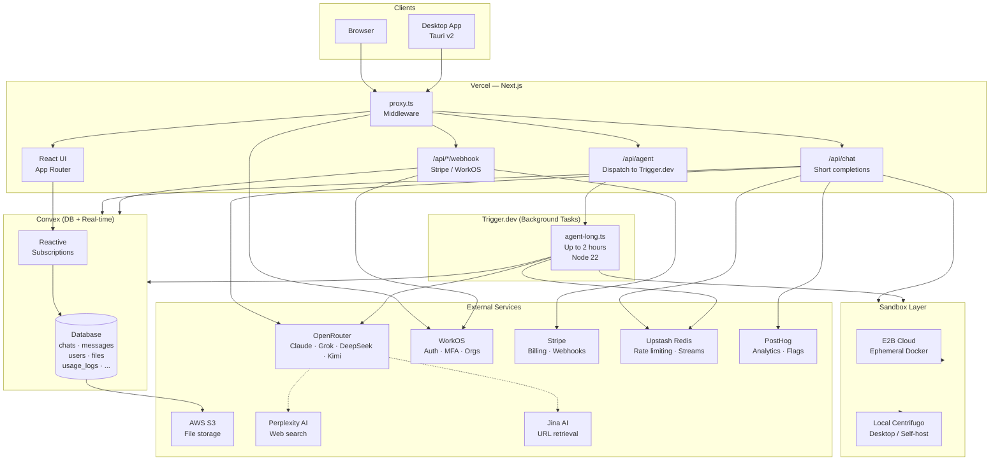
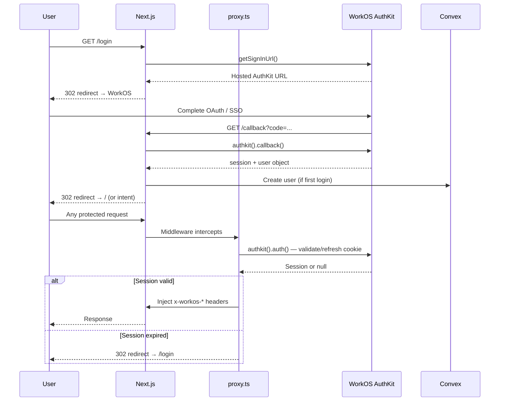
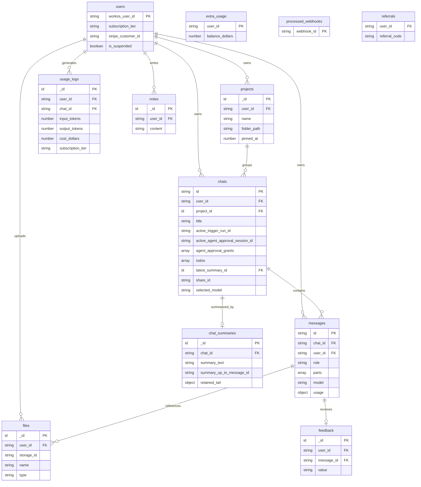
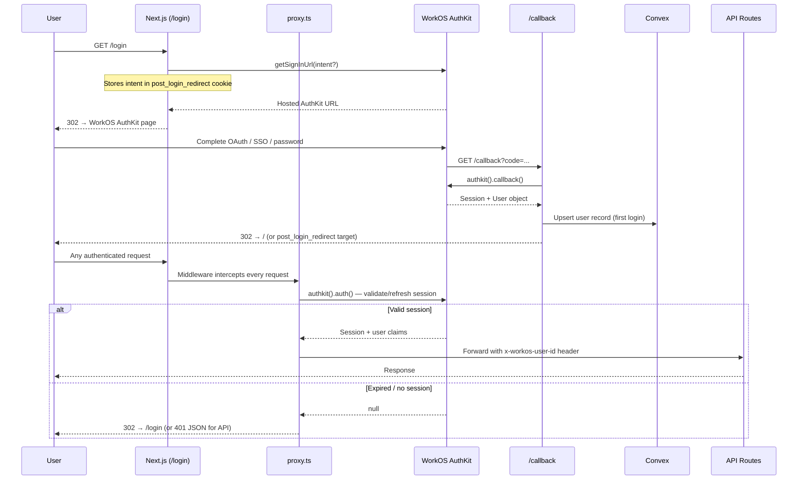
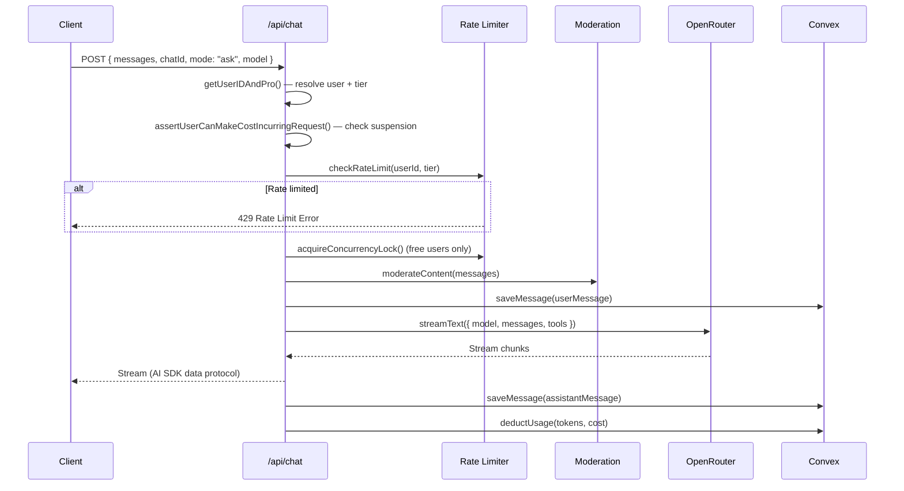
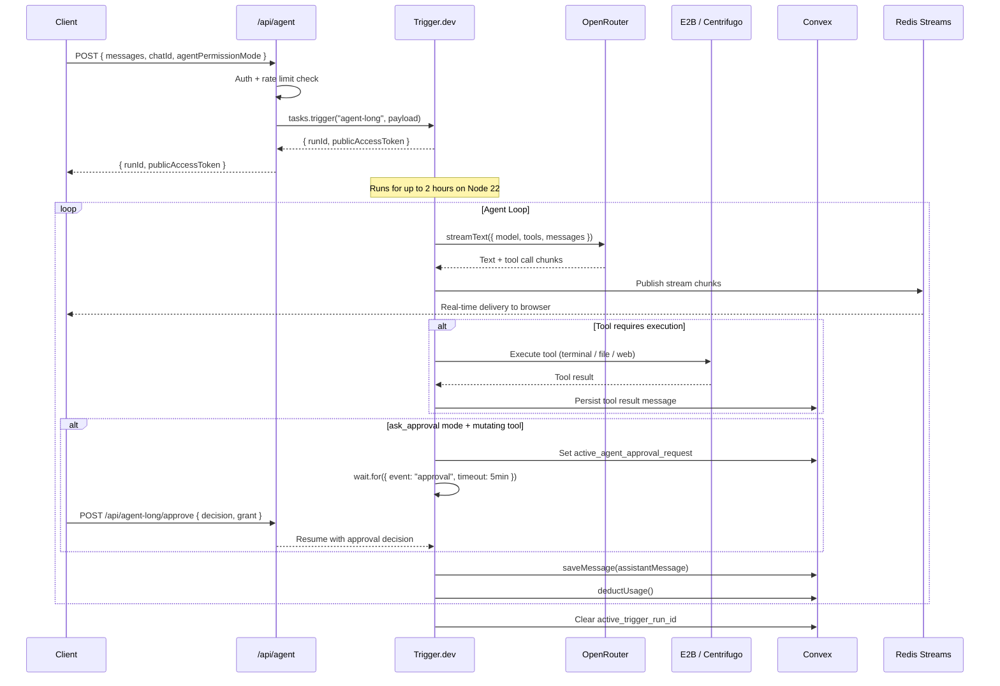
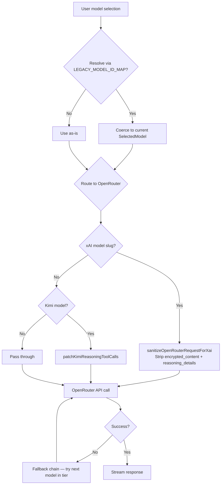
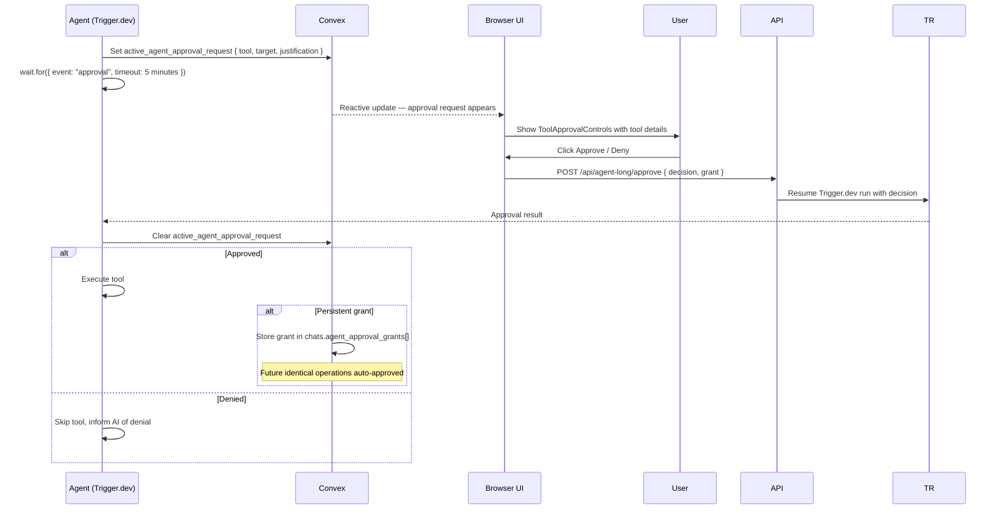

# HackerAI — Official Technical Documentation

> **Version:** 1.0 · **Date:** 2026-07-26  
> **Repository:** [github.com/hackerai-tech/hackerai](https://github.com/hackerai-tech/hackerai)  
> **Live product:** [hackerai.co](https://hackerai.co)

---

## Table of Contents

1. [Project Overview](#1-project-overview)
2. [Features](#2-features)
3. [Complete Folder / File Tree](#3-complete-folder--file-tree)
4. [Architecture](#4-architecture)
5. [Architecture Diagram](#5-architecture-diagram)
6. [Tech Stack](#6-tech-stack)
7. [Important Files and Responsibilities](#7-important-files-and-responsibilities)
8. [Environment Variables](#8-environment-variables)
9. [Authentication Flow](#9-authentication-flow)
10. [Database Schema & Relationships](#10-database-schema--relationships)
11. [API Flow](#11-api-flow)
12. [AI Models & Model Routing](#12-ai-models--model-routing)
13. [Agent Tools](#13-agent-tools)
14. [Approval System](#14-approval-system)
15. [Context & Memory Management](#15-context--memory-management)
16. [Deployment Workflow](#16-deployment-workflow)
17. [Security Design](#17-security-design)
18. [Security Observations](#18-security-observations)
19. [Potential Risks](#19-potential-risks)
20. [Future Improvements](#20-future-improvements)
21. [Development Workflow](#21-development-workflow)
22. [Testing Strategy](#22-testing-strategy)
23. [Appendix](#23-appendix)

---

## 1. Project Overview

HackerAI is a **production-grade, AI-powered penetration testing assistant** available at [hackerai.co](https://hackerai.co). It provides a chat-first interface with two core interaction modes:

- **Ask mode** — Conversational Q&A on security topics, vulnerability analysis, and tool usage guidance.
- **Agent mode** — Autonomous pentesting sessions where the AI plans, executes terminal commands, reads and writes files, performs web searches, and interacts with a sandboxed environment — all without manual user intervention unless approval is required.

### Target Audience

The product is designed primarily for **individual security practitioners**: bug bounty hunters, solo pentesters, students, CTF competitors, and technical builders who want practical AI-assisted security workflows. Teams exist as a secondary surface.

### Business Model

SaaS subscription with five tiers: **Free / Pro / Pro-Plus / Ultra / Team**, billed through Stripe. On-demand credits ("extra usage") can be purchased independently. A referral reward system and team seat management are both fully implemented.

### Platform Surfaces

| Surface | Technology |
|---|---|
| Web App | Next.js App Router (Vercel) |
| Desktop App | Tauri v2 (Rust + Next.js), cross-platform |
| Local Sandbox Server | Node.js + Centrifugo WebSocket bridge |
| Background Agent Runtime | Trigger.dev (up to 2 hours per run) |

---

## 2. Features

### Core Chat Features
- **Ask mode** — Streaming AI responses via OpenRouter (Claude, Grok, DeepSeek, Kimi)
- **Agent mode** — Autonomous multi-step pentesting with real tool execution
- **Model selector** — Users choose Standard / Pro / Max / Auto tiers
- **Chat history** — Full sidebar with search, grouping, pinning, and projects
- **Message branching** — Fork a chat from any point in the conversation
- **Chat sharing** — Generate public read-only share links
- **Message search** — Full-text search across all chats (Convex searchIndex)
- **File uploads** — Attach files to messages; stored in Convex Storage or S3
- **Message feedback** — Per-message thumbs up/down stored in Convex
- **Regeneration** — Re-run any assistant message with a different model
- **Auto-continuation** — Agent automatically continues after tool call batches
- **Stream resumption** — Interrupted agent streams resume via Redis pub/sub

### Agent-Specific Features
- **Tool execution** — Terminal commands, file I/O, web search, URL fetching, HTTP requests
- **Interactive terminal sessions** — PTY-based sessions (SSH, meterpreter, etc.)
- **Sandbox environments** — E2B cloud or local Centrifugo (desktop) sandbox
- **Todo management** — AI maintains a structured task plan visible to the user
- **Approval gate** — `ask_approval` mode pauses tool execution for user sign-off
- **Persistent grants** — Approved tool patterns are stored and auto-approved in future turns
- **Doom-loop detection** — Prevents infinite empty-todo write cycles

### User Account Features
- **Authentication** — WorkOS AuthKit (OAuth, SSO, MFA)
- **Multi-factor authentication** — TOTP via WorkOS
- **Team management** — Invite members, manage seats, admin roles via WorkOS organizations
- **Billing portal** — Stripe customer portal for subscription management
- **On-demand credits** — Purchase additional usage beyond subscription tier
- **Usage dashboard** — Per-request token counts and cost breakdown
- **Referral system** — Referral codes with cookie tracking and reward crediting
- **Custom instructions** — Personalization (name, instructions) saved in Convex
- **Notes** — Persistent saved notes accessible within chats
- **Data deletion** — Full GDPR-style account and data deletion
- **PentestGPT migration** — Ingest legacy PentestGPT user accounts

### Platform Features
- **Desktop app** (Tauri) — Local file system access, local sandbox, offline-capable
- **Download page** — Multi-platform installer distribution (macOS/Windows/Linux/Android/iOS links)
- **PostHog analytics** — Event tracking, feature flags, experiments, source map upload
- **Moderation** — OpenAI content moderation on all user inputs

---

## 3. Complete Folder / File Tree

<details>
<summary>Click to expand full file tree</summary>

```
hackerai/
├── AGENTS.md                            # Agent coding guidelines for Codex/AI agents
├── README.md                            # Setup instructions, prerequisites
├── vercel.json                          # Vercel deployment config (schema-only)
├── next.config.ts                       # Next.js configuration (headers, image domains, TS)
├── trigger.config.ts                    # Trigger.dev task config (node-22, 2hr max)
├── tsconfig.json                        # TypeScript config
├── jest.config.js                       # Jest unit test configuration
├── playwright.config.ts                 # Playwright e2e test configuration
├── eslint.config.mjs                    # ESLint flat config
├── postcss.config.mjs                   # PostCSS (Tailwind v4)
├── proxy.ts                             # Next.js middleware (auth, referral, desktop UA)
├── instrumentation.ts                   # OpenTelemetry / PostHog server-side init
├── global.d.ts                          # Global TypeScript declarations
├── skills-lock.json                     # Replit skills config
├── .worktreeinclude                     # Git worktree file inclusion list
│
├── app/
│   ├── layout.tsx                       # Root layout (fonts, Convex, PostHog providers)
│   ├── providers.tsx                    # Client-side provider tree
│   ├── globals.css                      # Global styles (Tailwind v4)
│   ├── posthog.js                       # PostHog client singleton
│   │
│   ├── (chat)/                          # Main chat route group (authenticated)
│   │   ├── layout.tsx                   # Chat shell layout wrapper
│   │   └── page.tsx                     # Chat page — renders ChatLayout
│   │
│   ├── api/
│   │   ├── agent/                       # Agent mode dispatch + status polling
│   │   ├── agent-long/                  # Trigger.dev proxies (stream, cancel, approve)
│   │   ├── auth/                        # Desktop auth helpers
│   │   ├── billing/portal/              # Stripe billing portal session
│   │   ├── chat/                        # Chat CRUD + streaming (GET/POST/DELETE)
│   │   │   └── [id]/stream/route.ts     # Chat stream resumption endpoint
│   │   ├── chats/                       # Bulk chat deletion
│   │   ├── clear-auth-cookies/          # Session cookie cleanup
│   │   ├── delete-account/             # Account deletion flow
│   │   ├── delete-sandboxes/           # E2B sandbox cleanup
│   │   ├── entitlements/               # Subscription tier resolution
│   │   ├── extra-usage/webhook/        # On-demand credit purchase webhook (Stripe)
│   │   ├── fraud/webhook/              # Fraud event webhook
│   │   ├── health/                     # Health check endpoints (core, trigger-agent-mode)
│   │   ├── logout-all/                 # Global session revocation
│   │   ├── migrate-pentestgpt/         # PentestGPT user account migration
│   │   ├── mfa/                        # MFA factor management (list/enroll/verify/delete)
│   │   ├── referrals/                  # Referral reward tracking
│   │   ├── sandbox/                    # Sandbox lifecycle management
│   │   ├── subscribe/                  # Stripe checkout session creation
│   │   ├── subscription/webhook/       # Stripe subscription event webhook
│   │   ├── subscription-details/       # Active subscription info
│   │   ├── team/                       # Team member/invite management
│   │   ├── workos/                     # WorkOS webhook (org/membership sync)
│   │   ├── stripe.ts                   # Stripe SDK singleton
│   │   └── workos.ts                   # WorkOS SDK singleton
│   │
│   ├── components/
│   │   ├── chat.tsx                    # Core chat orchestration (~2000 lines)
│   │   ├── ChatLayout.tsx              # Sidebar + main panel layout
│   │   ├── ChatHeader.tsx              # Top bar (model selector, share, actions)
│   │   ├── Messages.tsx                # Message list renderer
│   │   ├── MessageItem.tsx             # Individual message display
│   │   ├── MessagePartHandler.tsx      # Routes message parts to correct renderers
│   │   ├── MessageEditor.tsx           # Inline message edit UI
│   │   ├── MessageActions.tsx          # Copy / feedback / branch actions
│   │   ├── MessageErrorState.tsx       # Error display within messages
│   │   ├── MemoizedMarkdown.tsx        # Memoized Markdown renderer
│   │   ├── CodeHighlight.tsx           # Shiki syntax highlighted code blocks
│   │   ├── ComputerCodeBlock.tsx       # Diff / computer-use code display
│   │   ├── ComputerSidebar.tsx         # Right-panel: tool output / terminal
│   │   ├── computer-sidebar-utils.tsx  # Utilities for sidebar content
│   │   ├── DataStreamProvider.tsx      # AI SDK useChat wrapper with custom stream
│   │   ├── Sidebar.tsx                 # Left navigation sidebar
│   │   ├── SidebarHistory.tsx          # Full chat history list
│   │   ├── SidebarChatSections.tsx     # Grouped (Today / Yesterday / …) sections
│   │   ├── SidebarHeader.tsx           # Sidebar header (new chat button, search)
│   │   ├── SidebarUserNav.tsx          # User avatar + settings trigger
│   │   ├── SidebarProjects.tsx         # Project grouping in sidebar
│   │   ├── SidebarProjectItem.tsx      # Single project row
│   │   ├── SidebarProjectThreads.tsx   # Threads under a project
│   │   ├── ChatItem.tsx                # Individual chat history row
│   │   ├── Header.tsx                  # Mobile header
│   │   ├── Footer.tsx                  # Input area / prompt footer
│   │   ├── ModelSelector.tsx           # Model tier picker (Standard/Pro/Max/Auto)
│   │   ├── SandboxSelector.tsx         # Cloud vs local sandbox picker
│   │   ├── HackingSuggestions.tsx      # Rotating starter prompt suggestions
│   │   ├── AttachmentButton.tsx        # File attachment trigger
│   │   ├── FileUploadPreview.tsx       # Attached file chips before send
│   │   ├── AllFilesDialog.tsx          # File management dialog
│   │   ├── FileContentViewer.tsx       # Inline file content viewer
│   │   ├── FilePartRenderer.tsx        # Renders file parts inside messages
│   │   ├── ImageViewer.tsx             # Image preview modal
│   │   ├── DragDropOverlay.tsx         # Full-window drag-and-drop overlay
│   │   ├── SettingsDialog.tsx          # Tabbed settings modal
│   │   ├── AccountTab.tsx              # Account settings tab
│   │   ├── SecurityTab.tsx             # MFA / password security tab
│   │   ├── PersonalizationTab.tsx      # Custom name/instructions tab
│   │   ├── DataControlsTab.tsx         # Data export / delete tab
│   │   ├── UsageTab.tsx                # Usage logs + billing tab
│   │   ├── SharedLinksTab.tsx          # Shared chat management tab
│   │   ├── AgentsTab.tsx               # Agent permissions configuration
│   │   ├── RemoteControlTab.tsx        # Local sandbox configuration
│   │   ├── TeamTab.tsx                 # Team members management
│   │   ├── PricingDialog.tsx           # Subscription / upgrade modal
│   │   ├── TeamPricingDialog.tsx       # Team plan pricing modal
│   │   ├── UpgradeConfirmationDialog.tsx
│   │   ├── BillingFrequencySelector.tsx
│   │   ├── CancelSubscriptionDialog.tsx
│   │   ├── ExtraUsageSection.tsx       # On-demand credit purchase UI
│   │   ├── TeamExtraUsageSection.tsx
│   │   ├── TeamMembersList.tsx
│   │   ├── TeamDialogs.tsx             # Create/edit/delete team dialogs
│   │   ├── ShareDialog.tsx             # Share chat as public link
│   │   ├── ManageSharedChatsDialog.tsx
│   │   ├── TodoPanel.tsx               # Agent task list (todos) sidebar panel
│   │   ├── QueuedMessagesPanel.tsx     # Queued messages during active agent run
│   │   ├── BranchIndicator.tsx         # Visual indicator for branched chats
│   │   ├── ScrollToBottomButton.tsx
│   │   ├── MessageSearchDialog.tsx     # Full-text chat message search
│   │   ├── ManageNotesDialog.tsx       # Saved notes management
│   │   ├── CustomizeHackerAIDialog.tsx # AI persona customization
│   │   ├── AgentPermissionSelector.tsx # full_access vs ask_approval toggle
│   │   ├── FeedbackInput.tsx           # Thumbs up/down message feedback
│   │   ├── FinishReasonNotice.tsx      # Stream finish reason display
│   │   ├── RateLimitWarning.tsx        # Rate limit hit banner
│   │   ├── ReasoningHandler.tsx        # Thinking / reasoning block renderer
│   │   ├── SourcesDialog.tsx           # Web search source citations modal
│   │   ├── SummarizationStatusDivider.tsx  # Shows when context was summarized
│   │   ├── ChunkLoadRecovery.tsx       # JS chunk load error auto-recovery
│   │   ├── ConvexErrorBoundary.tsx     # Convex error boundary wrapper
│   │   ├── XtermRenderer.tsx           # xterm.js in-browser terminal emulator
│   │   ├── DiffView.tsx                # File diff display component
│   │   ├── MarkdownTable.tsx           # Enhanced markdown table renderer
│   │   ├── MfaVerificationDialog.tsx
│   │   ├── DeleteMfaFactorDialog.tsx
│   │   ├── MigratePentestgptDialog.tsx
│   │   ├── MoveChatToProjectDialog.tsx
│   │   ├── ProjectCreateDialog.tsx
│   │   ├── ProjectDeleteDialog.tsx
│   │   ├── ProjectEditDialog.tsx
│   │   ├── ReferralRewardDialog.tsx
│   │   ├── DeleteAccountDialog.tsx
│   │   ├── worked-for-parts.ts         # Utility: classify which message parts succeeded
│   │   ├── chat-route.ts               # Chat URL / routing helpers
│   │   ├── sidebar-chat-drag.ts        # Drag-to-reorder sidebar logic
│   │   ├── testUtils.tsx               # Shared component test utilities
│   │   └── tools/
│   │       ├── TerminalToolHandler.tsx   # Renders terminal tool output
│   │       ├── FileHandler.tsx           # File tool result display
│   │       ├── FileToolsHandler.tsx      # Multi-file tool wrapper
│   │       ├── GetTerminalFilesHandler.tsx
│   │       ├── HttpRequestToolHandler.tsx
│   │       ├── NotesToolHandler.tsx
│   │       ├── notes-tool-utils.tsx
│   │       ├── ProxyToolHandler.tsx
│   │       ├── SummarizationHandler.tsx
│   │       ├── TodoToolHandler.tsx
│   │       ├── WebToolHandler.tsx
│   │       ├── ToolApprovalControls.tsx  # Approve / deny UI for ask_approval mode
│   │       └── shell-tool-utils.ts
│   │       └── usage/
│   │           ├── IncludedUsageCard.tsx
│   │           ├── OnDemandUsageCard.tsx
│   │           ├── TokenBreakdownTooltip.tsx
│   │           ├── usage-charge.ts
│   │           └── UsageLogsTable.tsx
│   │
│   ├── hooks/
│   │   ├── useAutoContinue.ts          # Auto-continuation after tool call batches
│   │   ├── useAutoResume.ts            # Resume interrupted agent streams
│   │   ├── useChatHandlers.ts          # All chat event handlers (send/regen/steer)
│   │   ├── useChats.ts                 # Convex reactive chat list query
│   │   ├── useDocumentDragAndDrop.ts   # Document-level drag and drop
│   │   ├── useFeedback.ts              # Message feedback mutation
│   │   ├── useFileUpload.ts            # File upload orchestration
│   │   ├── useFileUrlCache.ts          # Signed file URL caching
│   │   ├── useHasAuthenticatedBefore.ts
│   │   ├── useLatestRef.ts             # Stable ref to latest value (avoids stale closures)
│   │   ├── useMessageScroll.ts         # Auto-scroll behaviour management
│   │   ├── useMoveChatToProjectAction.ts
│   │   ├── usePentestgptMigration.ts
│   │   ├── usePricingDialog.ts
│   │   ├── useProjects.ts
│   │   ├── useSandboxPreference.ts
│   │   ├── useSidebarNavigation.ts
│   │   ├── useStartNewChat.ts
│   │   ├── useTauri.ts                 # Tauri desktop bridge (~300 lines)
│   │   ├── useToolSidebar.ts           # Tool output panel open/close state
│   │   ├── useTypingAnimation.ts
│   │   └── useUpgrade.ts
│   │
│   ├── contexts/
│   │   ├── AgentApprovalContext.tsx    # Tool approval gate for ask_approval mode
│   │   ├── FileUrlCacheContext.tsx     # Context for cached signed file URLs
│   │   ├── GlobalState.tsx             # Global chat state (model, mode, etc.)
│   │   ├── Hac45AgentOnlyContext.tsx   # Feature flag: agent-only model access
│   │   ├── SidebarProjectList.tsx      # Sidebar project list context
│   │   └── TodoBlockContext.tsx        # Agent todos state
│   │
│   ├── utils/
│   │   └── task-ui-copy.ts             # UI copy strings for task/agent status
│   │
│   ├── auth-error/page.tsx             # Auth error recovery page
│   ├── callback/route.ts               # WorkOS OAuth callback handler
│   ├── desktop-callback/route.ts       # Desktop app OAuth callback
│   ├── desktop-login/route.ts          # Desktop login redirect
│   ├── download/                       # Desktop app download page + platform icons
│   ├── invite/[code]/route.ts          # Referral invite link handler
│   ├── login/route.ts                  # Login redirect → WorkOS
│   ├── logout/route.ts                 # Session termination
│   ├── privacy-policy/page.tsx
│   ├── robots.txt/route.ts
│   ├── share/[id]/page.tsx             # Public shared chat read-only view
│   ├── sitemap.xml/route.ts
│   └── trust/page.tsx
│
├── convex/                             # Convex backend (DB + serverless functions)
│   ├── schema.ts                       # Full DB schema (919 lines, 20+ tables)
│   ├── auth.config.ts                  # WorkOS JWT validator config
│   ├── convex.config.ts                # Convex component registration
│   ├── crons.ts                        # Scheduled cleanup jobs (soft-delete, S3 GC)
│   ├── chats.ts                        # Chat CRUD queries/mutations
│   ├── messages.ts                     # Message storage + retrieval
│   ├── projects.ts                     # Project CRUD
│   ├── files.ts                        # File metadata queries
│   ├── fileActions.ts                  # File action mutations
│   ├── fileAggregate.ts                # File aggregate queries
│   ├── fileStorage.ts                  # Convex Storage operations
│   ├── usageLogs.ts                    # Token/cost tracking
│   ├── extraUsage.ts                   # On-demand credit balance queries
│   ├── extraUsageActions.ts            # Credit addition mutations
│   ├── referrals.ts                    # Referral reward system
│   ├── rateLimitStatus.ts              # Rate limit bucket status queries
│   ├── sharedChats.ts                  # Public share access (anonymized)
│   ├── notes.ts                        # Saved notes CRUD
│   ├── feedback.ts                     # Per-message feedback mutations
│   ├── userCustomization.ts            # Custom name/instructions storage
│   ├── userDeletion.ts                 # GDPR account + data deletion
│   ├── userSuspensions.ts              # Fraud/abuse suspension logic
│   ├── teamExtraUsage.ts               # Team-level credit queries
│   ├── teamExtraUsageActions.ts        # Team credit mutations
│   ├── unitEconomics.ts                # Cost analytics queries
│   ├── unitEconomicsLib.ts             # Cost analytics helpers
│   ├── accountIdentities.ts            # PentestGPT migration identity mapping
│   ├── cancellationReasons.ts          # Churn/cancellation reason tracking
│   ├── chatStreams.ts                   # Active stream ID management
│   ├── tempStreams.ts                   # Temporary stream state
│   ├── localSandbox.ts                 # Local Centrifugo sandbox session tracking
│   ├── s3Actions.ts                    # S3 file upload/download actions
│   ├── s3Cleanup.ts                    # S3 garbage collection
│   ├── s3Utils.ts                      # S3 utility functions
│   ├── redisPubsub.ts                  # Redis pub/sub for stream delivery
│   ├── constants.ts                    # Shared Convex constants
│   ├── lib/                            # Convex internal utilities
│   │   └── retainedTail.ts             # Retained-tail validator for summaries
│   └── _generated/                     # Auto-generated Convex types + API
│
├── lib/
│   ├── ai/
│   │   ├── providers.ts                # Model registry + OpenRouter client factory
│   │   ├── openrouter-attribution.ts   # OpenRouter attribution headers
│   │   ├── output-limits.ts            # Per-model output token limits
│   │   └── tools/
│   │       ├── index.ts                # Tool registry (all tools exported)
│   │       ├── schemas.ts              # Zod schemas for all tool inputs/outputs
│   │       ├── run-terminal-cmd.ts     # Shell command execution tool
│   │       ├── interact-terminal-session.ts  # Interactive PTY tool
│   │       ├── file.ts                 # File read / write / view / append tools
│   │       ├── web-search.ts           # Perplexity AI web search tool
│   │       ├── open-url.ts             # Jina AI URL content retrieval
│   │       ├── notes.ts                # Notes read/write tool
│   │       ├── todo-write.ts           # Todo management tool
│   │       ├── get-terminal-files.ts   # Sandbox file tree listing
│   │       ├── tool-brief.ts           # Tool call summary generation
│   │       ├── tool-failure.ts         # Tool failure handling + logging
│   │       ├── prompt-serialization.ts # Tool prompt serialization helpers
│   │       └── utils/
│   │           ├── HybridSandboxManager.ts    # Routes to E2B or local sandbox
│   │           ├── CentrifugoSandbox.ts        # Local WebSocket sandbox client
│   │           ├── SandboxManager.ts           # E2B cloud sandbox manager
│   │           └── sandbox-file-uploader.ts    # File transfer into sandbox
│   │
│   ├── analytics/                      # Agent completion signals, PostHog events
│   ├── api/
│   │   ├── chat-handler.ts             # POST /api/chat handler factory
│   │   ├── chat-stream-helpers.ts      # Streaming helpers, model fallback chains
│   │   ├── agent-trigger-route.ts      # POST /api/agent Trigger.dev dispatcher
│   │   └── response.ts                 # Error/response utility functions
│   ├── auth/                           # Auth helpers + expected-auth-errors
│   ├── billing/                        # Stripe price IDs, tier allowances
│   ├── centrifugo/                     # Centrifugo client (local sandbox WS)
│   ├── chat/
│   │   ├── chat-processor.ts           # Core AI streaming loop
│   │   ├── doom-loop-detection.ts      # Empty todo write loop detection
│   │   └── summarization.ts            # Rolling context window summarization
│   ├── constants/                      # App-wide shared constants
│   ├── db/
│   │   └── actions.ts                  # Convex client-side action wrappers
│   ├── desktop-auth.ts                 # Desktop app auth helpers
│   ├── errors.ts                       # Error class hierarchy
│   ├── experiments.ts                  # PostHog feature flag helpers
│   ├── extra-usage.ts                  # On-demand credit helpers
│   ├── limit-pressure.ts               # Usage pressure signals (near-limit warnings)
│   ├── logger.ts                       # Structured logger
│   ├── moderation.ts                   # OpenAI content moderation
│   ├── pricing/                        # Pricing config, tier limits
│   ├── provider-usage-cost.ts          # Token → USD cost mapping per model
│   ├── rate-limit/                     # Token bucket + sliding window rate limiters
│   ├── referrals/                      # Referral code validation, cookie config
│   ├── suspensionMessage.ts            # Suspension user-facing messages
│   ├── suspensions.ts                  # Suspension check helpers
│   ├── system-prompt/                  # Modular system prompt builders
│   ├── system-prompt.ts                # Root system prompt (pentesting domain context)
│   ├── token-limits.ts                 # Context window limits per model
│   ├── token-utils.ts                  # Token counting utilities
│   ├── usage-projection.ts             # Remaining budget estimation
│   ├── usage-tracker.ts                # Per-request token/cost accumulation
│   └── utils/                          # Misc utilities (shiki, etc.)
│
├── trigger/
│   ├── agent-long.ts                   # Trigger.dev task: autonomous agent loop
│   ├── stream-ids.ts                   # Agent stream ID management
│   └── streams.ts                      # Upstash Redis stream helpers
│
├── types/
│   ├── index.ts                        # Re-exports from all type files
│   ├── chat.ts                         # ChatMode, SelectedModel, SubscriptionTier
│   ├── user.ts                         # User and UserProfile types
│   ├── agent.ts                        # Tool approval protocol types
│   └── file.ts                         # File and FilePart types
│
├── hooks/                              # Root-level shared hooks
├── components/                         # Root-level shared components
│
├── packages/
│   ├── local/                          # Local sandbox Node.js server
│   │   └── src/
│   │       ├── index.ts                # Server entry + Centrifugo bridge
│   │       ├── process-runner.ts       # Subprocess execution manager
│   │       └── command-cancellation.ts # Command cancellation handling
│   └── desktop/                        # Tauri v2 desktop application
│       ├── src/                        # Next.js pages for desktop wrapper
│       └── src-tauri/                  # Rust backend: PTY, IPC, file system
│           ├── pty.rs                  # PTY (pseudo-terminal) management
│           └── Cargo.lock              # Rust dependency lock file
│
├── e2b/                                # E2B sandbox build scripts
│   ├── build.dev.ts                    # Build + register dev sandbox template
│   └── build.prod.ts                   # Build + register prod sandbox template
│
├── docker/
│   └── Dockerfile                      # Docker image for E2B sandbox template
│
├── scripts/
│   ├── setup.ts                        # Interactive first-run setup script
│   ├── accept-invitation.ts            # Accept WorkOS team invitation
│   ├── attach-failing-card.ts          # Test Stripe failing card scenarios
│   ├── check-openrouter-gen-id.ts      # Debug OpenRouter generation IDs
│   ├── cleanup-deleted-user-residue.ts # Admin: clean orphaned user data
│   ├── create-test-users.ts            # E2E test user provisioning
│   ├── paid-daily-free-allowance-dev.ts  # Dev: grant free daily allowance
│   ├── reset-rate-limit.ts             # Dev: reset rate limit buckets
│   ├── trigger-dev-branch.mjs          # Branch-based Trigger.dev routing
│   ├── upload-posthog-sourcemaps.mjs   # Post-build source map upload
│   ├── validate-s3-security.ts         # S3 bucket security validation
│   └── verify-email.ts                 # Dev: mark email as verified
│
├── __tests__/                          # Top-level integration/config tests
│   ├── auth-preflight.test.ts
│   ├── next-config-build-settings.test.ts
│   └── proxy.test.ts
│
└── public/
    ├── icon-256x256.png
    ├── icon-512x512.png
    ├── manifest.json
    └── images/
        └── referral-popup-hackerai.avif
```

</details>

---

## 4. Architecture

HackerAI is built as a **distributed, multi-service system** stitched together at the API layer. No single server runs everything. Each concern is delegated to a specialist service.

### Layer Breakdown

| Layer | Role | Technology |
|---|---|---|
| **Frontend** | UI, real-time subscriptions, routing | Next.js App Router, React, Convex client |
| **Middleware** | Auth enforcement, session refresh, referral injection | `proxy.ts` (WorkOS AuthKit) |
| **API Layer** | Short completions, billing, team, webhooks | Next.js API Routes |
| **Background Tasks** | Long agent runs (up to 2 hours) | Trigger.dev (node-22 runtime) |
| **Database** | Persistent storage, real-time subscriptions | Convex |
| **AI Inference** | All LLM calls | OpenRouter (primary), Vercel AI SDK |
| **Sandboxing** | Secure tool execution environment | E2B Cloud or local Centrifugo |
| **Authentication** | Identity, MFA, organizations | WorkOS AuthKit |
| **Billing** | Subscriptions, webhooks, on-demand credits | Stripe |
| **Rate Limiting** | Token bucket + sliding window | Upstash Redis |
| **Stream Resumption** | Redis pub/sub for interrupted agent streams | Upstash Redis |
| **File Storage** | Uploaded files | Convex Storage (default) or AWS S3 |
| **Analytics** | Events, feature flags, experiments | PostHog |
| **Desktop** | Native cross-platform app | Tauri v2 (Rust) |
| **Web Search** | External web retrieval | Perplexity AI, Jina AI |

### Module Communication Map

```
Browser / Desktop
  │  (HTTPS)
  ▼
proxy.ts (Next.js middleware)
  ├── Validates / refreshes WorkOS session cookie
  ├── Injects x-workos-* headers for downstream handlers
  └── Injects referral cookie on ?referral_code= param
        │
        ▼
Next.js API Routes
  ├── /api/chat      ──► lib/api/chat-handler.ts
  │                         ├── lib/rate-limit/ (Redis)
  │                         ├── lib/moderation.ts (OpenAI)
  │                         ├── lib/chat/chat-processor.ts
  │                         │       └── lib/ai/providers.ts (OpenRouter)
  │                         │               └── lib/ai/tools/ (E2B / Centrifugo)
  │                         └── convex/messages.ts (via CONVEX_SERVICE_ROLE_KEY)
  │
  ├── /api/agent     ──► lib/api/agent-trigger-route.ts
  │                         └── Trigger.dev: trigger/agent-long.ts
  │                               ├── lib/ai/providers.ts (OpenRouter)
  │                               ├── lib/ai/tools/ (E2B / Centrifugo)
  │                               ├── convex/* (persistence throughout)
  │                               └── Redis streams (stream resumption)
  │
  ├── /api/*/webhook ──► Stripe / WorkOS event handlers
  │                         └── convex/* (update user/subscription state)
  │
  └── /api/team /api/mfa /api/subscribe ──► WorkOS + Stripe SDKs

Browser ◄──► Convex (real-time reactive subscriptions)
              └── All chat, message, usage, todo state live-updates
```

---

## 5. Architecture Diagram

### System Overview (Mermaid)



### Authentication Flow (Mermaid)



### Database Relationship Diagram (Mermaid)



---

## 6. Tech Stack

| Category | Technology | Version / Notes |
|---|---|---|
| **Framework** | Next.js | 15, App Router, Turbopack |
| **Language** | TypeScript | 6 |
| **Styling** | Tailwind CSS | v4, tw-animate-css |
| **UI Primitives** | Radix UI | shadcn/ui component layer |
| **State / Real-time** | Convex | Reactive queries, serverless mutations/actions |
| **Auth** | WorkOS AuthKit | OAuth, SSO, MFA, Organizations |
| **AI SDK** | Vercel AI SDK | v6 (`ai` package), streaming data protocol |
| **AI Provider** | OpenRouter | Primary — routes to all models |
| **LLM Models** | Claude (Anthropic), Grok (xAI), DeepSeek, Kimi K2, Gemini | All via OpenRouter |
| **Background Tasks** | Trigger.dev | v4, durable tasks, Node 22, 2hr max |
| **Cloud Sandbox** | E2B | Ephemeral Docker containers |
| **Local Sandbox** | Centrifugo + Node.js | WebSocket bridge for desktop/self-host |
| **Payments** | Stripe | Subscriptions, webhooks, on-demand credits, portal |
| **File Storage** | Convex Storage | Default; AWS S3 as optional alternate |
| **Rate Limiting** | Upstash Redis | Sliding window (free) + token bucket (paid) |
| **Stream Resumption** | Upstash Redis | Pub/sub for interrupted agent streams |
| **Moderation** | OpenAI API | Content moderation on user inputs |
| **Web Search** | Perplexity AI | AI web search tool |
| **URL Retrieval** | Jina AI Reader | Web URL content extraction |
| **Analytics** | PostHog | Events, feature flags, experiments, source maps |
| **Code Highlighting** | Shiki | Server-side syntax highlighting |
| **Terminal Rendering** | xterm.js | In-browser PTY terminal emulator |
| **Desktop App** | Tauri v2 | Rust backend + Next.js frontend |
| **Desktop PTY** | node-pty | Pseudo-terminal management in Rust/Node bridge |
| **Unit Testing** | Jest | jsdom environment, ~50+ test files |
| **E2E Testing** | Playwright | Chromium/Firefox/WebKit/Mobile |
| **Deployment** | Vercel | Next.js hosting |
| **Package Manager** | pnpm | 10.33.2, workspaces |

---

## 7. Important Files and Responsibilities

| File | Responsibility |
|---|---|
| `proxy.ts` | Next.js middleware — the single auth choke point. Enforces WorkOS session validity, injects `x-workos-*` headers, handles desktop UA detection, injects referral cookies. Any auth bypass must start here. |
| `convex/schema.ts` | Single source of truth for all Convex tables (919 lines, 20+ tables). Change this file to add/modify any persisted data structure. |
| `convex/auth.config.ts` | Configures Convex to accept and validate WorkOS-issued JWTs. Required for Convex to trust server-side identity claims. |
| `trigger/agent-long.ts` | The autonomous agent task — manages multi-step tool loops, budget tracking, approval waiting, stream state, and retry logic for up to 2 hours per run. |
| `lib/ai/providers.ts` | Model registry — maps tier slugs (`hackerai-standard/pro/max`) to OpenRouter model IDs. Also handles request sanitization for xAI (strip `encrypted_content`) and Kimi (patch tool call format). |
| `lib/system-prompt.ts` | Pentesting-domain system prompt with dynamic context: cloud vs. local sandbox mode, `DANGEROUS MODE` warnings for local execution. |
| `lib/api/chat-handler.ts` | Factory for `POST /api/chat` — orchestrates auth, rate limiting, moderation, streaming, and usage tracking in the correct order. |
| `lib/api/chat-stream-helpers.ts` | Defines per-tier model fallback chains. If the primary model fails, tries 2–3 alternatives before returning an error. |
| `lib/chat/chat-processor.ts` | Core streaming loop — calls AI SDK `streamText()`, handles tool calls, writes incremental output to Convex. |
| `lib/rate-limit/` | Two strategies: token bucket (paid users, monthly budget) and sliding window (free users, daily limit). Backed by Upstash Redis. |
| `lib/usage-tracker.ts` | `UsageTracker` class — accumulates token counts, cache hits/misses, and authoritative cost across all streaming steps for accurate billing. |
| `lib/ai/tools/utils/HybridSandboxManager.ts` | Routes tool execution to E2B cloud or local Centrifugo sandbox based on user preference and availability. |
| `lib/ai/tools/utils/CentrifugoSandbox.ts` | WebSocket-based local sandbox — full terminal and file operations over a Centrifugo connection to the desktop app or self-hosted server. |
| `lib/chat/doom-loop-detection.ts` | Detects repetitive empty todo writes and terminates the agent loop before it burns unlimited credits. |
| `app/components/chat.tsx` | ~2000-line orchestration component — manages Standard vs. Agent-Long transport, message reconciliation, auto-continuation, approval gate wiring, and stream resumption. |
| `app/contexts/AgentApprovalContext.tsx` | Provides the approval gate context — when `ask_approval` mode is active, tool execution pauses here and waits for the user's decision. |
| `types/chat.ts` | Core domain types: `ChatMode`, `SelectedModel`, `SubscriptionTier`, `AgentPermissionMode`, and the `LEGACY_MODEL_ID_MAP` for backwards compatibility. |
| `trigger.config.ts` | Trigger.dev configuration — node-22 runtime (required for globalThis.WebSocket), 2hr max duration, native module handling (`node-pty`, `sharp`). |
| `lib/billing/included-usage.ts` | Stripe price IDs per tier and monthly token/cost allowances per subscription level. |
| `app/api/workos.ts` | WorkOS SDK singleton — shared across all API routes for auth, MFA, and org operations. |
| `app/api/stripe.ts` | Stripe SDK singleton — shared across billing, subscribe, and webhook routes. |

---

## 8. Environment Variables

### Required (App will not start / function without these)

| Variable | Used In | Description |
|---|---|---|
| `NEXT_PUBLIC_CONVEX_URL` | `app/providers.tsx` | Client-side Convex deployment URL |
| `CONVEX_SERVICE_ROLE_KEY` | All server-side Convex calls | Master key — bypasses Convex auth for privileged server operations |
| `CONVEX_DEPLOY_KEY` | Convex deploy / Trigger.dev actions | Convex deployment authorization |
| `WORKOS_API_KEY` | `app/api/workos.ts` | WorkOS server SDK key — auth, MFA, org management |
| `WORKOS_CLIENT_ID` | WorkOS AuthKit config | OAuth client identifier |
| `WORKOS_COOKIE_PASSWORD` | AuthKit session encryption | Must be ≥32 characters; encrypts session cookies |
| `OPENROUTER_API_KEY` | `lib/ai/providers.ts` | All LLM inference calls |
| `OPENAI_API_KEY` | `lib/moderation.ts` | Content moderation on user inputs |
| `TRIGGER_SECRET_KEY` | Trigger.dev task dispatch | Authenticates task triggers and management |
| `TRIGGER_PROJECT_ID` | `trigger.config.ts` | Associates tasks with the Trigger.dev project |
| `STRIPE_SECRET_KEY` | `app/api/stripe.ts` | Subscription and billing operations |
| `STRIPE_SUBSCRIPTION_WEBHOOK_SECRET` | `/api/subscription/webhook` | Stripe event signature verification |
| `STRIPE_EXTRA_USAGE_WEBHOOK_SECRET` | `/api/extra-usage/webhook` | On-demand credit event verification |

### Required for Rate Limiting & Stream Resumption

| Variable | Used In | Description |
|---|---|---|
| `REDIS_URL` or `UPSTASH_REDIS_REST_URL` | `lib/rate-limit/` | Rate limit bucket storage |
| `UPSTASH_REDIS_REST_TOKEN` | Upstash Redis auth | Upstash authentication token |

### Optional / Feature-gated

| Variable | Used In | Description |
|---|---|---|
| `ANTHROPIC_API_KEY` | Direct Anthropic fallback | Used if OpenRouter is unavailable |
| `DEEPSEEK_API_KEY` | Direct DeepSeek fallback | Used if OpenRouter is unavailable |
| `E2B_API_KEY` | `lib/ai/tools/utils/SandboxManager.ts` | E2B cloud sandbox provisioning |
| `PERPLEXITY_API_KEY` | `lib/ai/tools/web-search.ts` | Web search tool |
| `JINA_API_KEY` | URL retrieval tool | Web URL content extraction |
| `S3_ENDPOINT` | `convex/s3Actions.ts` | S3-compatible storage endpoint |
| `S3_ACCESS_KEY_ID` | `convex/s3Actions.ts` | S3 access credentials |
| `S3_SECRET_ACCESS_KEY` | `convex/s3Actions.ts` | S3 secret credentials |
| `NEXT_PUBLIC_POSTHOG_KEY` | `app/posthog.js` | PostHog analytics client key |
| `NEXT_PUBLIC_POSTHOG_HOST` | `app/posthog.js` | PostHog host URL |
| `POSTHOG_CLI_API_KEY` | `scripts/upload-posthog-sourcemaps.mjs` | Source map upload post-build |
| `POSTHOG_CLI_PROJECT_ID` | `scripts/upload-posthog-sourcemaps.mjs` | PostHog project for source maps |
| `TRIGGER_VERSION` | Branch-based Trigger.dev routing | Routes dev branches to correct worker |
| `VERCEL_ENV` | `proxy.ts`, `next.config.ts` | `preview` or `production` — affects routing and TS build settings |
| `VERCEL_URL` | `proxy.ts` | Preview deployment URL for OAuth callback construction |

> **Note:** There is no `.env.example` file in the repository. Run `pnpm run setup` for an interactive setup, or manually configure variables from this table.

---

## 9. Authentication Flow

### Standard Web Login



### Desktop App Login

1. User opens Desktop App (Tauri) → navigates to `/desktop-login`
2. Desktop login route detects `HackerAI-Desktop` User-Agent header
3. Redirects to WorkOS with a `desktop-callback` redirect URI
4. WorkOS returns to `/desktop-callback` → extracts auth token
5. Token passed back to Tauri via custom URL scheme redirect

### Path Authorization Rules

| Path Pattern | Auth Required |
|---|---|
| `/api/health/*`, `/robots.txt`, `/sitemap.xml` | No (bypass) |
| `/`, `/login`, `/signup`, `/logout`, `/callback` | No |
| `/desktop-login`, `/desktop-callback`, `/auth-error` | No |
| `/privacy-policy`, `/terms-of-service`, `/trust`, `/download` | No |
| `/share/*` | No (public read-only) |
| `/invite/*` | No (referral landing) |
| `/api/*/webhook` | No (signature-verified separately) |
| Everything else | **Yes — WorkOS session required** |

### Convex Auth Layers

| Layer | Mechanism | Scope |
|---|---|---|
| User-facing mutations | `ctx.auth.getUserIdentity()` + ownership check (`user_id === identity.subject`) | Per-user data only |
| Server-side privileged | `serviceKey` arg validated against `CONVEX_SERVICE_ROLE_KEY` | Any user's data |

---

## 10. Database Schema & Relationships

HackerAI uses **Convex exclusively** as its database. There is no SQL/PostgreSQL. All data is stored in Convex tables with automatic indexing.

### Table Reference

| Table | Purpose | Key Indexes |
|---|---|---|
| `projects` | User-created project folders grouping related chats | `by_user_and_created`, `by_user_and_updated`, `by_user_and_pinned` |
| `chats` | Individual conversation threads | `by_chat_id`, `by_user_and_updated`, `by_user_project_and_updated`, `by_share_id`, `search_title` |
| `chat_summaries` | Rolling conversation summaries for context compression | `by_chat_id` |
| `messages` | Individual messages (user/assistant/system) with structured `parts[]` | `by_message_id`, `by_chat_id`, `by_user_id`, `search_content` |
| `files` | Uploaded file metadata (storage ID → Convex Storage or S3) | `by_user_id`, `by_storage_id` |
| `usage_logs` | Per-request token counts and cost records | `by_user_id`, `by_chat_id` |
| `extra_usage` | On-demand credit balance per user | `by_user_id` |
| `referrals` | Referral code records and reward state | `by_user_id`, `by_referral_code` |
| `referral_rewards` | Pending and awarded referral bonuses | — |
| `notes` | Persistent user notes (read/writable by agent) | `by_user_id` |
| `feedback` | Per-message thumbs up/down feedback | `by_message_id`, `by_user_id` |
| `userCustomization` | Custom name and persona instructions per user | `by_user_id` |
| `userSuspensions` | Fraud/abuse suspension records | `by_user_id` |
| `cancellationReasons` | Churn reason tracking on subscription cancel | — |
| `chat_streams` | Active stream IDs for live stream delivery | `by_chat_id` |
| `temp_streams` | Short-lived temporary stream state | — |
| `local_sandboxes` | Centrifugo local sandbox session tracking | `by_user_id` |
| `processed_webhooks` | Idempotency table for Stripe webhook deduplication | `by_webhook_id` |
| `accountIdentities` | PentestGPT → HackerAI identity mapping | — |
| `teamExtraUsage` | Team-level on-demand credit pools | `by_org_id` |

### Key Schema Details

**`chats` table** — carries rich runtime state:
```
active_trigger_run_id         → links to Trigger.dev run for cancellation
active_agent_approval_session_id → links to pending approval session
active_agent_approval_request → current pending approval (tool + justification)
agent_approval_grants[]       → persistent grants (auto-approved patterns)
todos[]                       → AI task list (id, content, status, sourceMessageId)
latest_summary_id             → pointer to current rolling summary
selected_model                → user-chosen model for this chat
sandbox_type                  → "cloud" | "local"
codex_thread_id               → LEGACY — retained on old rows, nothing reads/writes it
```

**`messages` table** — `parts[]` is `any[]` and carries:
- `{ type: "text", text: string }`
- `{ type: "tool-call", toolCallId, toolName, args }`
- `{ type: "tool-result", toolCallId, result }`
- `{ type: "file", fileId }`
- `{ type: "reasoning", text }` (thinking blocks)

**`chat_summaries`** — includes `retained_tail` (recent verbatim messages kept post-summary) and `previous_summaries[]` (chained summary history).

---

## 11. API Flow

### Short Chat — Ask Mode



### Long Agent — Agent Mode



### Webhook Flows

```
POST /api/subscription/webhook  (Stripe)
  1. stripe.webhooks.constructEvent() — verify signature
  2. Check processed_webhooks — skip if already handled
  3. Mark webhook as processed (idempotency)
  4. invoice.paid → update user subscription_tier in Convex + reset rate limit
  5. subscription.deleted → downgrade tier to "free"
  6. Award referral rewards if applicable

POST /api/extra-usage/webhook  (Stripe)
  1. Verify Stripe signature
  2. Read session.metadata.userId + amountDollars
  3. Add credits to extra_usage balance in Convex

POST /api/workos/webhook
  1. Sync WorkOS organization membership changes to local state
```

### Key API Endpoints Reference

| Method | Path | Auth | Purpose |
|---|---|---|---|
| `POST` | `/api/chat` | ✅ | Short AI completion (streaming) |
| `DELETE` | `/api/chat/[id]` | ✅ | Delete chat + cancel active Trigger runs |
| `DELETE` | `/api/chats` | ✅ | Delete all chats for user |
| `POST` | `/api/agent` | ✅ | Dispatch Trigger.dev agent task |
| `POST` | `/api/agent/status` | ✅ | Poll Trigger.dev run status |
| `GET` | `/api/entitlements` | ✅ | Resolve subscription tier |
| `GET/POST/DELETE` | `/api/mfa/*` | ✅ | WorkOS MFA factor management |
| `GET` | `/api/team/members` | ✅ (team) | List team members + invitations |
| `DELETE` | `/api/team/members` | ✅ (team) | Remove member or revoke invitation |
| `POST` | `/api/team/invite` | ✅ (admin) | Invite member to WorkOS org |
| `POST` | `/api/subscribe/*` | ✅ | Create Stripe checkout session |
| `POST` | `/api/billing/portal` | ✅ | Generate Stripe billing portal URL |
| `POST` | `/api/subscription/webhook` | ❌ (Stripe sig) | Handle Stripe subscription events |
| `POST` | `/api/extra-usage/webhook` | ❌ (Stripe sig) | Handle on-demand credit purchase |
| `POST` | `/api/workos/webhook` | ❌ (WorkOS sig) | Sync org membership changes |
| `GET` | `/api/health/core` | ❌ | Core health check |
| `GET` | `/api/health/trigger-agent-mode` | ❌ | Agent mode availability check |

---

## 12. AI Models & Model Routing

### User-Facing Tiers

| Slug | Underlying Model | Provider | Notes |
|---|---|---|---|
| `hackerai-standard` | Grok 4.5 | xAI via OpenRouter | Entry tier; request sanitization strips `encrypted_content` / `reasoning_details` |
| `hackerai-pro` | Claude Sonnet 4.6 | Anthropic via OpenRouter | Mid tier |
| `hackerai-max` | Claude Opus 4.6 | Anthropic via OpenRouter | Highest quality |
| `auto` | Router-selected | — | System picks based on query type and tier |

### Legacy Model ID Map (backwards compatibility)

| Legacy ID | Maps To |
|---|---|
| `sonnet-4.6` | `hackerai-pro` |
| `opus-4.6` | `hackerai-max` |
| `gemini-3-flash` | `hackerai-standard` |
| `kimi-k2.6` | `hackerai-standard` |
| `grok-4.1`, `grok-4.3`, `grok-4.5` | `hackerai-standard` |
| `hackerai-lite` | `hackerai-standard` |

### Request Pipeline (`lib/ai/providers.ts`)



### Model Fallback Chains (per tier on failure)

Defined in `lib/api/chat-stream-helpers.ts`:
- **Pro tier (`HACKERAI_PRO_FALLBACK_CHAIN`)**: Tries 2–3 alternative Pro-tier models before surfacing an error to the user.
- Fallback is automatic and transparent to the user.

### OpenRouter Attribution

All OpenRouter requests include attribution headers (`lib/ai/openrouter-attribution.ts`) to identify HackerAI as the originating application.

---

## 13. Agent Tools

All tools are defined in `lib/ai/tools/` with Zod schemas in `lib/ai/tools/schemas.ts`. Tools execute in the sandbox layer (E2B or local Centrifugo).

### Tool Registry

| Tool Name | File | Description |
|---|---|---|
| `run_terminal_cmd` | `run-terminal-cmd.ts` | Execute shell commands; streams output chunks in real-time |
| `interact_terminal_session` | `interact-terminal-session.ts` | Interactive PTY session (SSH, meterpreter, etc.) |
| `file_view` | `file.ts` | View file contents with optional pagination and data inclusion |
| `file_read` | `file.ts` | Read specific byte ranges from a file |
| `file_write` | `file.ts` | Create or overwrite files |
| `file_append` | `file.ts` | Append content to existing files |
| `file_state` | `file.ts` | Track and query file metadata within the sandbox |
| `web_search` | `web-search.ts` | Perplexity AI-powered web search |
| `open_url` | `open-url.ts` | Jina AI URL content retrieval and parsing |
| `get_terminal_files` | `get-terminal-files.ts` | List file tree within the sandbox |
| `todo_write` | `todo-write.ts` | Create, update, and complete agent task items |
| `notes` | `notes.ts` | Read/write persistent user notes (stored in Convex) |
| `http_request` | *(via proxy handler)* | Make HTTP requests from within the sandbox |

### Tool Execution Environment

Tools pass parameters via environment variables prefixed with `HACKERAI_*` into Python scripts running inside the sandbox, for example:

```python
# file.ts injects:
HACKERAI_FILE_VIEW_PATH=/path/to/file
HACKERAI_FILE_VIEW_INCLUDE_DATA=1
HACKERAI_FILE_VIEW_MAX_BYTES=10485760
```

### Sandbox Abstraction (`HybridSandboxManager`)

```
User preference: "cloud" or "local"
        │
        ▼
HybridSandboxManager
  ├── cloud → SandboxManager (E2B)
  │           Creates ephemeral Docker container
  │           Returns E2B sandbox handle
  │
  └── local → CentrifugoSandbox
              WebSocket connection to local Centrifugo server
              (runs on user's machine or self-hosted)
              Falls back to E2B if local is unavailable
```

### Doom-Loop Detection (`lib/chat/doom-loop-detection.ts`)

The agent is terminated if it repeatedly writes empty todos above a threshold. This prevents run-away agent loops that consume budget without making progress.

---

## 14. Approval System

### Modes

| Mode | Behavior |
|---|---|
| `full_access` | Agent executes all tools immediately — no user confirmation required |
| `ask_approval` | Agent pauses before any mutating tool and waits for user decision |

### Mutating Tools That Trigger Approval

In `ask_approval` mode, the following tool types require approval:
- `terminal_execute`
- `terminal_interact`
- `file_write`
- `file_append`
- `file_edit`

### Approval Flow



### Persistent Grants

When a user approves a tool pattern with a "persistent" grant, the grant is stored in `chats.agent_approval_grants[]`. The grant validator (`agentApprovalTargetGrantValidator`) stores:

```
terminal_command grant:
  { kind: "terminal_command", targetPrefix, executable, argv[] }

file_change grant:
  { kind: "file_change", targetPrefix, path, pathFlavor: "posix" | "windows" }
```

Future tool calls matching a stored grant are auto-approved without user interaction.

---

## 15. Context & Memory Management

### Rolling Summarization

As conversations grow, the context window can exceed model limits. HackerAI manages this with a rolling summarization strategy (`lib/chat/summarization.ts`):

1. A lightweight model generates a `summary_text` capturing key findings and context up to `summary_up_to_message_id`.
2. The summary is stored in `chat_summaries`.
3. A `retained_tail` preserves the most recent N verbatim messages post-summary, so the AI always sees recent context in full fidelity.
4. A `SummarizationStatusDivider` component visually indicates where summarization occurred in the chat history.
5. `previous_summaries[]` in `chat_summaries` maintains a chain of all prior summaries for auditability.

### Token Budget & Limits

- `lib/token-limits.ts` — per-model context window limits
- `lib/token-utils.ts` — token counting utilities
- `lib/usage-projection.ts` — estimates remaining budget before hitting the monthly limit
- `lib/limit-pressure.ts` — surfaces near-limit warnings in the UI

### Notes Tool (Persistent Memory)

The `notes` tool allows the AI agent to read and write persistent notes stored in Convex (`convex/notes.ts`). Notes survive across sessions and are scoped per user, allowing the agent to maintain long-term context about the user's targets, findings, and preferences.

### Todo System

The agent maintains a structured task plan via `todo_write`:
- Each todo has: `id`, `content`, `status` (pending / in_progress / completed / cancelled), `sourceMessageId`
- Visible to the user in real-time via `TodoPanel.tsx`
- Users can "steer" the agent by editing todos via `useChatHandlers.ts`
- Doom-loop detection terminates agents that repeatedly write empty todos

---

## 16. Deployment Workflow

### Production Stack

```
┌─────────────────────────────────────┐
│           Vercel                    │
│  Next.js build (next build)         │
│  Automatic deploys on main push     │
│  Preview deploys on PRs             │
└────────────────┬────────────────────┘
                 │
     ┌───────────┼───────────┐
     ▼           ▼           ▼
  Convex     Trigger.dev    E2B
  Deploy     Deploy         Sandbox
  (schema    (task worker   Template
  auto-      deploy)        Build
  migrate)
```

### Build Pipeline

```bash
# Next.js build (Vercel runs automatically)
next build

# Post-build: upload source maps to PostHog (production only)
pnpm posthog:sourcemaps

# Convex deployment
npx convex deploy  # uses CONVEX_DEPLOY_KEY

# Trigger.dev deployment (separate step)
# Triggered via Trigger.dev dashboard or CLI

# E2B sandbox template build
pnpm e2b:build:dev   # dev template
pnpm e2b:build:prod  # prod template
```

### `trigger.config.ts` Key Settings

```typescript
runtime: "node-22"         // Required: globalThis.WebSocket for CentrifugoSandbox
maxDuration: 2 * 60 * 60  // 2 hours per agent run
retries: { maxAttempts: 3, factor: 2, randomize: true }
build.external: ["node-pty", "sharp"]  // Native modules — not bundled
// @e2b/code-interpreter is intentionally BUNDLED to avoid ERR_REQUIRE_ESM
```

### `vercel.json`

Currently contains only a `$schema` declaration. All routing, headers, and function config is handled by Next.js itself. If security headers or custom rewrites are needed, they must be added here or in `next.config.ts`.

### Desktop App Build

```bash
cd packages/desktop
pnpm build    # Builds Tauri app (Rust + Next.js)
# Outputs: macOS .dmg, Windows .exe, Linux .AppImage
```

### Docker / E2B Sandbox Image

```bash
# Build Docker image for E2B sandbox
pnpm docker:build:push    # Builds + pushes multi-arch image

# Register with E2B
pnpm e2b:build:dev        # Dev template
pnpm e2b:build:prod       # Prod template
```

### Branch-Based Trigger.dev Routing

`scripts/trigger-dev-branch.mjs` — Routes development branch builds to the correct Trigger.dev worker version, enabling parallel branch testing without worker conflicts.

---

## 17. Security Design

### Defense-in-Depth Strategy

```
Layer 1: Network — Vercel edge, HTTPS only, Stripe signature on webhooks
Layer 2: Middleware — proxy.ts enforces WorkOS session on every request
Layer 3: API — per-route auth checks, suspension verification, rate limiting
Layer 4: Convex — ownership enforcement on all user-facing mutations
Layer 5: Sandbox — all AI tool execution is isolated inside E2B or local container
Layer 6: Moderation — OpenAI content moderation on all user inputs
```

### Rate Limiting Architecture

| Tier | Strategy | Limit |
|---|---|---|
| Free | Sliding window (Redis) | Daily token budget |
| Paid | Token bucket (Redis) | Monthly token/cost budget |
| Free (concurrency) | In-memory lock | 1 concurrent request |

Rate limits are enforced in `lib/rate-limit/` and applied in `lib/api/chat-handler.ts` and `lib/api/agent-trigger-route.ts` before any AI inference.

### Webhook Security

All incoming webhooks are signature-verified before processing:
- **Stripe subscriptions**: `stripe.webhooks.constructEvent(body, sig, STRIPE_SUBSCRIPTION_WEBHOOK_SECRET)`
- **Stripe extra-usage**: `stripe.webhooks.constructEvent(body, sig, STRIPE_EXTRA_USAGE_WEBHOOK_SECRET)`
- **WorkOS**: WorkOS SDK webhook signature validation

Stripe webhooks also use the `processed_webhooks` Convex table for idempotency — duplicate deliveries are detected and skipped.

### Convex Access Control

| Access Pattern | Mechanism |
|---|---|
| User reads own data | `ctx.auth.getUserIdentity()` + `user_id === identity.subject` check |
| Server writes any data | `serviceKey` argument validated against `CONVEX_SERVICE_ROLE_KEY` |
| Public share reads | `getSharedChat` anonymizes data; checks fraud suspension flag |

### Content Moderation

All user messages pass through `lib/moderation.ts` (OpenAI moderation API) before reaching the AI model. Flagged content is rejected with an appropriate user-facing error.

### Referral Cookie Security

```typescript
cookieOptions = {
  httpOnly: true,
  secure: process.env.NODE_ENV === "production",
  sameSite: "lax",
  maxAge: config.cookieMaxAgeSeconds,
  path: "/",
}
```

---

## 18. Security Observations

### ✅ Well-Implemented

| Observation | Detail |
|---|---|
| Webhook signature verification | Both Stripe endpoints use `constructEvent()` with dedicated secrets — no raw body parsing risk |
| Webhook idempotency | `processed_webhooks` table prevents double-processing of any Stripe event |
| Convex ownership enforcement | User mutations verify `chat.user_id === identity.subject` — prevents IDOR |
| Multi-strategy rate limiting | Token bucket + sliding window with concurrency lock for free users |
| Session cookie security | `httpOnly`, `secure` (production), `sameSite: lax`, encrypted via `WORKOS_COOKIE_PASSWORD` |
| Content moderation | OpenAI moderation applied to all user inputs before AI inference |
| Fraud suspension check | `assertUserCanMakeCostIncurringRequest()` gates all billable operations |
| Shared chat anonymization | Public share reads strip PII; fraud suspension blocks sharing |
| Desktop UA isolation | `HackerAI-Desktop` User-Agent routes to separate auth callback path |

---

## 19. Potential Risks

| Risk | Severity | Detail |
|---|---|---|
| `CONVEX_SERVICE_ROLE_KEY` is a master key | 🔴 High | Any server-side code or leaked env can bypass Convex auth entirely and read/write any user's data. Rotate frequently; never log it; audit all usages. |
| Broad `remotePatterns` in `next.config.ts` | 🟡 Medium | `hostname: "**"` allows any URL through Next.js image optimization — a known SSRF / tracking vector. Tighten to an explicit domain allowlist. |
| `on-demand credit metadata trust` | 🟡 Medium | `/api/extra-usage/webhook` reads `session.metadata.amountDollars` without cross-checking the actual Stripe `amount_total`. Manipulated metadata could miscredit balances. |
| No Content-Security-Policy header | 🟡 Medium | The app renders AI-generated markdown (a potential XSS surface) but has no CSP configured — neither in `vercel.json` nor `next.config.ts`. |
| `HACKERAI_*` env vars as sandbox parameters | 🟡 Medium | File tool parameters are passed via Python `os.environ`. Path traversal attempts by a compromised prompt would be mitigated by the sandbox OS, but not by the code itself. |
| Agent `full_access` mode — no command gate | 🟡 Medium | In `full_access` mode the AI can execute arbitrary shell commands. The sandbox is the only security boundary; no command allowlist exists in code. |
| Desktop "DANGEROUS MODE" — local execution | 🟡 Medium | Local Centrifugo sandbox gives AI real terminal access on the user's machine. System prompt warns the user, but the code enforces no command restrictions. |
| Verbose Convex mutation diagnostics | 🟢 Low | `messages.saveMessage` logs `parts_json_chars`, `text_chars` on failure — could expose content sizes to log aggregation systems in production. |
| Deprecated Rust crate in Desktop | 🟢 Low | `packages/desktop/src-tauri/Cargo.lock` references a crate at `0.5.20+deprecated`. Should be audited and updated. |
| Missing `.env.example` file | 🟢 Low | No `.env.example` exists — developers and CI pipelines must reverse-engineer all required variables from code and README. |

---

## 20. Future Improvements

### Architecture

1. **Split `chat.tsx`** — The ~2000-line component handles too many responsibilities. Split into focused sub-components: `StandardChatTransport`, `AgentLongTransport`, `MessageReconciler`. Each is a distinct state machine.

2. **Add `.env.example`** — List all variables with descriptions, required/optional flags, and example values. Current interactive setup script helps but fails silently in CI.

3. **Runtime request body validation** — Add Zod validation at the Next.js API boundary for all incoming request bodies. Currently, types are TypeScript-only with no runtime guard.

4. **Paginate `chats` Convex query** — The sidebar loads all chats for a user. At scale this is expensive. The `by_user_and_updated` index is already present — add cursor-based pagination.

### Security

5. **Add Content-Security-Policy headers** — Configure in `next.config.ts` `headers()` or `vercel.json`. Priority: the app renders AI-generated markdown which is a credible XSS surface.

6. **Narrow image `remotePatterns`** — Replace `hostname: "**"` with an explicit allowlist of trusted domains (Convex Storage CDN, S3 domain, WorkOS avatar URL).

7. **Validate `amountDollars` against Stripe `amount_total`** — In the extra-usage webhook, cross-check `session.metadata.amountDollars` against the actual checkout amount before crediting.

8. **Audit `CONVEX_SERVICE_ROLE_KEY` usage** — Document and periodically rotate the key. Consider adding function-level audit logging for all service-key-gated Convex calls.

### Developer Experience

9. **Clean up legacy model aliases** — Run a one-time Convex migration to coerce stale model IDs in existing rows, then remove entries from `LEGACY_MODEL_ID_MAP` in `types/chat.ts`.

10. **Remove or restore PostHog AI tracing** — The commented-out blocks in `lib/ai/providers.ts` (lines 1–7, 356–384) should either be deleted or re-enabled behind a feature flag.

11. **Explicit TypeScript return types on API handlers** — Several `route.ts` files rely on inferred types, making function signatures harder to audit.

12. **Document `CONVEX_SERVICE_ROLE_KEY` rotation procedure** — Add a runbook section to the README or a separate ops guide. There is currently no documented process.

13. **Address the legacy `codex_thread_id` field** — The field is retained on old rows but nothing reads or writes it. Plan and execute a schema migration to clean it up.

---

## 21. Development Workflow

### Prerequisites

| Service | Required | Notes |
|---|---|---|
| OpenRouter | ✅ | AI model provider |
| OpenAI | ✅ | Content moderation |
| E2B | ✅ | Cloud sandbox for agent mode |
| Convex | ✅ | Database and backend |
| WorkOS | ✅ | Authentication |
| Trigger.dev | ✅ | Durable agent task runtime |
| Upstash Redis | ✅ | Rate limiting + stream resumption |
| Stripe | ⬜ Optional | Billing (can skip for dev) |
| AWS S3 | ⬜ Optional | File storage (Convex Storage is the default) |
| Perplexity | ⬜ Optional | Web search tool |
| Jina AI | ⬜ Optional | URL content retrieval |
| PostHog | ⬜ Optional | Analytics |

### First-Time Setup

```bash
git clone https://github.com/hackerai-tech/hackerai.git
cd hackerai
pnpm install
pnpm run setup   # Interactive env var setup wizard
```

### Running Locally

```bash
# Start everything (Next.js + Convex)
pnpm dev

# Or run services individually in separate terminals:
pnpm dev:next     # Next.js on :3000 (Turbopack)
pnpm dev:convex   # Convex dev backend (local tunnel)
pnpm dev:trigger  # Trigger.dev branch worker

# All three together (including Trigger.dev):
pnpm dev:all
```

### Common Dev Commands

```bash
pnpm typecheck              # Full TypeScript check (all packages)
pnpm lint                   # ESLint across app/, lib/, types/, __mocks__
pnpm format                 # Prettier format all files
pnpm test                   # Run Jest unit tests
pnpm test:watch             # Jest in watch mode
pnpm test:coverage          # Jest with coverage report

# Admin / dev scripts
pnpm run reset-rate-limit         # Reset Redis rate limit buckets
pnpm run paid-allowance:dev       # Grant paid daily allowance (dev)
pnpm run rate-limit:reset         # Reset rate limit for a user
pnpm run user:verify-email        # Mark email as verified

# Desktop app
pnpm desktop:dev              # Tauri desktop in dev mode
pnpm desktop:build            # Build desktop distributable

# E2B sandbox
pnpm e2b:build:dev            # Build + register dev sandbox template
pnpm e2b:build:prod           # Build + register prod sandbox template

# Local sandbox server
pnpm local-sandbox            # Run local sandbox Node.js server
```

### Environment Notes

- `VERCEL_ENV` is used in `proxy.ts` to construct the correct OAuth callback URL for preview deployments.
- `TRIGGER_VERSION` enables branch-based routing to Trigger.dev workers — set this when running dev branches against a shared Trigger.dev project.
- Convex schema changes auto-migrate on `npx convex deploy` — no manual migration files are needed.

---

## 22. Testing Strategy

### Unit Tests (Jest)

```bash
pnpm test            # Run all unit tests
pnpm test:ci         # CI mode: --ci --coverage --maxWorkers=2
pnpm test:watch      # Watch mode
pnpm test:coverage   # Coverage report
```

**Coverage areas:**

| Area | Test Files |
|---|---|
| Chat stream helpers | `lib/api/__tests__/` |
| AI tool schemas | `lib/ai/tools/__tests__/` |
| File tool (Python script injection) | `lib/ai/tools/__tests__/file.test.ts` |
| CentrifugoSandbox | `lib/ai/tools/utils/__tests__/centrifugo-sandbox.test.ts` |
| Sandbox file uploader | `lib/ai/tools/utils/__tests__/sandbox-file-uploader.test.ts` |
| Doom-loop detection | Covered in chat processor tests |
| Rate limiting | `lib/rate-limit/__tests__/` |
| Error handling | `lib/__tests__/errors.test.ts` |
| Usage charge calculation | `app/components/usage/__tests__/usage-charge.test.ts` |
| UsageLogsTable | `app/components/usage/__tests__/UsageLogsTable.test.tsx` |
| Chat handlers | `app/hooks/__tests__/useChatHandlers.*.test.tsx` |
| GlobalState context | `app/contexts/__tests__/GlobalState.*.test.tsx` |
| AgentApprovalContext | `app/contexts/__tests__/AgentApprovalContext.test.tsx` |
| Tauri hook | `app/hooks/__tests__/useTauri.test.ts` |
| Proxy middleware | `__tests__/proxy.test.ts` |
| Auth preflight | `__tests__/auth-preflight.test.ts` |
| Next.js config | `__tests__/next-config-build-settings.test.ts` |
| Agent approval sandbox grants | `trigger/__tests__/agent-approval-sandbox-grants.test.ts` |
| Trigger agent post-wait auth | `trigger/__tests__/agent-long-post-wait-authorization.test.ts` |
| Type definitions | `types/__tests__/chat.test.ts` |
| Agent completion signals | `lib/analytics/__tests__/agent-completion-signals.test.ts` |

### E2E Tests (Playwright)

```bash
pnpm test:e2e              # Run all e2e tests
pnpm test:e2e:chromium     # Chromium only
pnpm test:e2e:firefox      # Firefox only
pnpm test:e2e:webkit       # WebKit / Safari only
pnpm test:e2e:mobile       # Mobile Chrome + Safari
pnpm test:e2e:headed       # Headed mode (see browser)
pnpm test:e2e:debug        # Debug mode with Playwright inspector
pnpm test:e2e:ui           # Playwright UI mode
pnpm test:e2e:report       # Show last test report
```

**E2E test setup:**

```bash
# Create test users in WorkOS (run once)
pnpm test:e2e:setup

# Individual test user management
pnpm test:e2e:users:create
pnpm test:e2e:users:delete
pnpm test:e2e:users:reset-passwords
```

### Test Environment Notes

- Unit tests use **jsdom** environment via Jest.
- Convex and WorkOS are mocked in unit tests via `__mocks__/`.
- E2E tests require a live WorkOS environment and test user accounts.
- `scripts/create-test-users.ts` provisions test accounts via WorkOS API.

---

## 23. Appendix

### Glossary

| Term | Definition |
|---|---|
| **Agent mode** | Autonomous AI mode where the AI plans and executes multi-step pentesting tasks with real tools |
| **Ask mode** | Conversational AI mode — no tool execution, pure Q&A |
| **E2B** | Cloud sandbox provider — creates ephemeral Docker containers for isolated code/tool execution |
| **Centrifugo** | Open-source WebSocket server used as the local sandbox communication bridge |
| **Trigger.dev** | Durable background task platform — runs long agent sessions beyond Next.js request timeouts |
| **WorkOS** | Authentication provider offering OAuth, SSO, MFA, and organization management |
| **OpenRouter** | AI model aggregator — provides unified API access to Claude, Grok, DeepSeek, Kimi, and others |
| **Convex** | Serverless database with real-time reactive queries and serverless functions |
| **hackerai-standard / pro / max** | User-facing model tier names (map to Grok 4.5 / Claude Sonnet / Claude Opus) |
| **full_access** | Agent permission mode: all tools execute without user confirmation |
| **ask_approval** | Agent permission mode: mutating tools pause and await user approval |
| **CONVEX_SERVICE_ROLE_KEY** | Master Convex key used by server-side code to bypass per-user auth |
| **retained_tail** | Recent verbatim messages preserved after a rolling summary |
| **doom-loop** | Runaway agent pattern where it repeatedly writes empty todos |
| **Tauri** | Cross-platform desktop app framework using Rust backend + web frontend |
| **PTY** | Pseudo-terminal — enables interactive terminal sessions within the sandbox |
| **PentestGPT** | Legacy product; users can migrate their account to HackerAI |

### Key Dependencies (Selected)

| Package | Purpose |
|---|---|
| `ai` (Vercel AI SDK) | Core streaming protocol, tool calling, useChat hook |
| `@openrouter/ai-sdk-provider` | OpenRouter provider for Vercel AI SDK |
| `@workos-inc/authkit-nextjs` | WorkOS auth integration for Next.js |
| `@convex-dev/workos` | Convex + WorkOS JWT bridge |
| `@trigger.dev/sdk` | Trigger.dev task definition + dispatch |
| `@e2b/code-interpreter` | E2B cloud sandbox client |
| `centrifuge-js` | Centrifugo WebSocket client (local sandbox) |
| `node-pty` | PTY for interactive terminal sessions |
| `@tauri-apps/api` | Tauri IPC bridge for desktop |
| `stripe` | Stripe Node.js SDK |
| `posthog-js` + `posthog-node` | PostHog analytics |
| `shiki` | Server-side syntax highlighting |
| `xterm` | Browser terminal emulator |
| `@monaco-editor/react` | Monaco code editor (for file editing) |
| `drizzle-orm` | Listed in dependencies but **not actively used** (Convex is the database) |
| `@langchain/community` | LangChain community integrations (limited usage) |
| `mermaid` | Mermaid diagram rendering in markdown |

### Script Reference

| Script | Command | Purpose |
|---|---|---|
| Setup | `pnpm run setup` | Interactive first-run env var configuration |
| Dev | `pnpm dev` | Next.js + Convex dev servers |
| Dev (all) | `pnpm dev:all` | Next.js + Convex + Trigger.dev |
| Build | `pnpm build` | Production Next.js build + PostHog source maps |
| Typecheck | `pnpm typecheck` | Full TypeScript type check |
| Lint | `pnpm lint` | ESLint across all source |
| Test | `pnpm test` | Jest unit tests |
| Test (e2e) | `pnpm test:e2e` | Playwright end-to-end tests |
| Reset rate limit | `pnpm rate-limit:reset` | Dev: clear Redis rate limit buckets |
| Build sandbox (dev) | `pnpm e2b:build:dev` | Build + register E2B dev template |
| Build sandbox (prod) | `pnpm e2b:build:prod` | Build + register E2B prod template |
| Validate S3 | `pnpm s3:validate` | Validate S3 bucket security config |
| Desktop dev | `pnpm desktop:dev` | Tauri desktop in development mode |
| Desktop build | `pnpm desktop:build` | Build desktop distributable |

### Architecture Decision Records (Notable)

| Decision | Rationale |
|---|---|
| **Convex over PostgreSQL** | Real-time reactivity without WebSocket infrastructure; schema migrations are automatic |
| **Trigger.dev for agent runs** | Overcomes Next.js 60s request timeout; provides durable execution, retries, and `wait.for()` for approval gates |
| **OpenRouter as primary AI provider** | Single API key for all models; automatic failover; no vendor lock-in |
| **node-22 runtime in Trigger.dev** | Required for `globalThis.WebSocket` — Centrifugo's JS client uses it; older Node runtimes throw on construction |
| **`@e2b/code-interpreter` bundled (not external)** | Bundling lets esbuild convert chalk's ESM to CJS inline; listing as external causes ERR_REQUIRE_ESM on Docker deploy |
| **`HACKERAI_*` env vars for sandbox tool params** | Python scripts running inside the sandbox read parameters via `os.environ`, avoiding shell injection via positional arguments |
| **`processed_webhooks` table for Stripe idempotency** | Stripe can deliver webhook events more than once; the table prevents double-crediting subscriptions |
| **Retained tail in chat summaries** | Ensures recent tool results and messages remain verbatim in context, preventing the AI from losing track of the most recent findings after a summary |

---

*This document was generated from a complete architectural analysis of the HackerAI codebase as of July 26, 2026. All information reflects the actual code and configuration — no information has been invented or assumed.*
